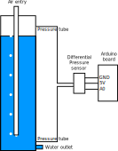
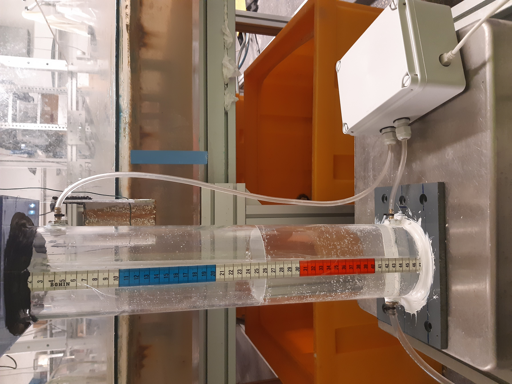
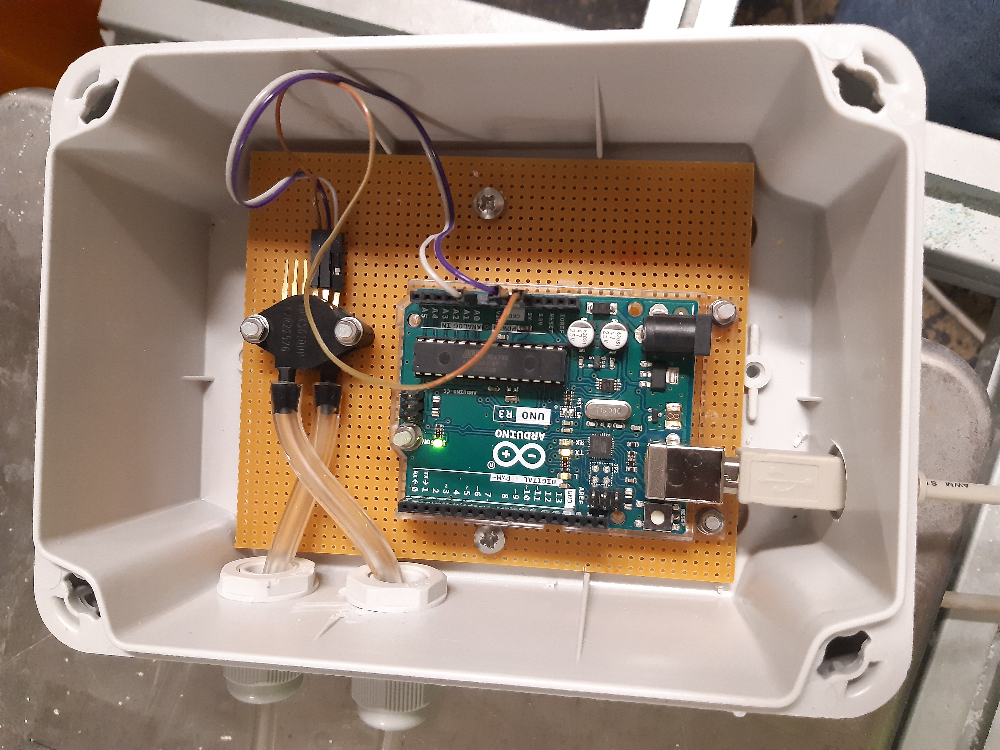

Mariotte
========

Python library of functions to handle the use of a Mariotte bottle for infiltration purposes.
The Mariotte bottles are equiped with a differential pressure transducer connected to an Arduino microcontroller. 

Bottle principle
----------------

Mariotte's bottle is a simple device used to maintain a constant pressure or flow rate. 
It consists of a sealed container with two tubes: one for the water outlet and the other for the air inlet. 
Its principle is based on the equilibrium between the water column and the air trapped in the upper part of the container: 
when water flows out through the lower opening, the volume of air at the top increases, and its pressure 
decreases (it is lower than atmospheric pressure).

    Schematic  principle of a Mariotte bottle

Because of the pressure balance within the bottle, 
the flow rate of water exiting the vessel depends solely on the difference in height between 
the outlet and the vent, and not on the remaining water level in the container, 
which then serves as a water reservoir. This mechanism ensures a constant water supply,  
an essential condition for reproducible infiltration measurements.   
This mechanism guarantees a constant flow rate

    Sample bottle

The two pressure sensors are connected to a differential pressure sensor, 
which is in turn connected to an Arduino Uno board. By calculating 
the difference between the pressure measured at the top (air) and that at the bottom of the tank 
(water), it is possible to determine the remaining water level at any given moment, without manual intervention. 
This device allows for continuous monitoring of the water level during infiltration tests.

    Arduino and pressure transducer

library
-------

